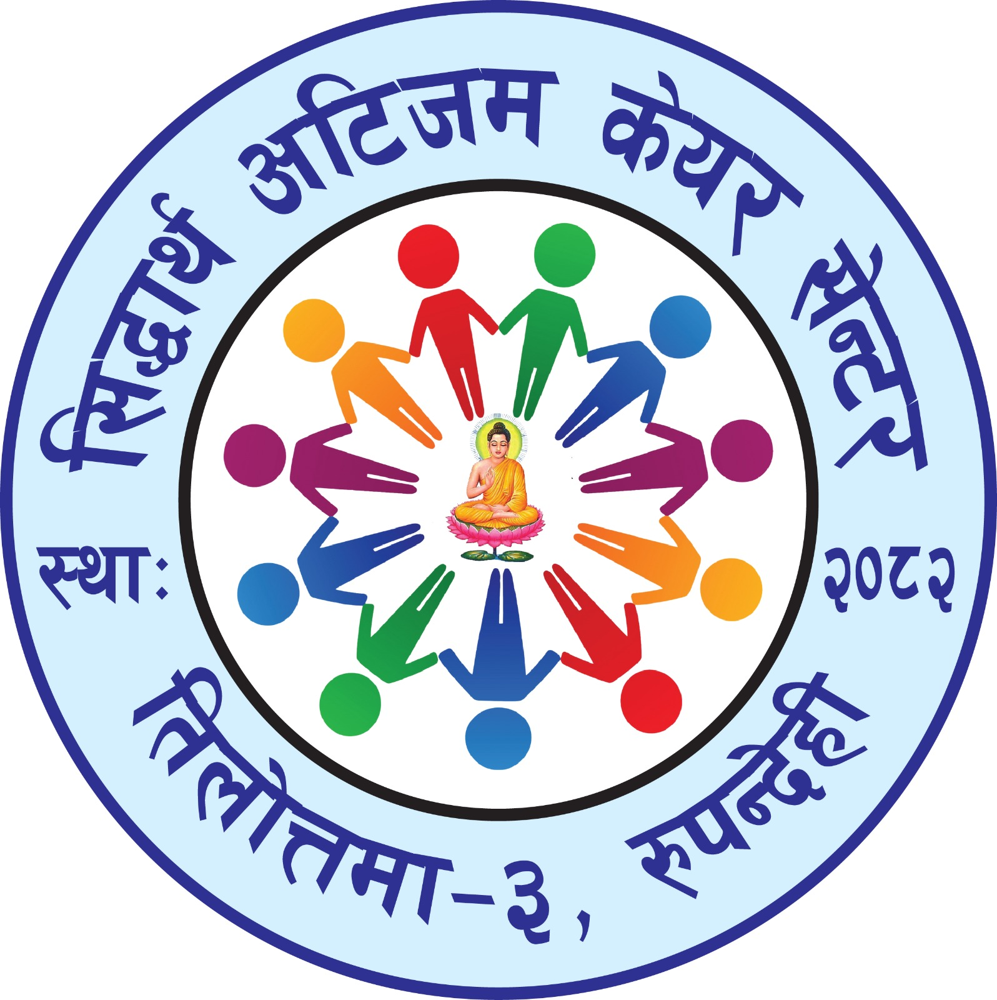

# Siddhartha Autism Care Center



**Compassionate Care for Every Child**

A professional, accessible, and data-driven website for the Siddhartha Autism Care Center — a newly established institution (March 2026) providing evidence-based education and support for children on the autism spectrum in Rupandehi, Nepal.

## About the Project

This website showcases the programs, mission, and vision of the Siddhartha Autism Care Center, established in March 2026 (2082/12/08 BS) to provide compassionate, specialized care and therapy for children on the autism spectrum in Rupandehi, Nepal.

### Key Features

- **Fully Responsive Design** - Optimized for desktop, tablet, and mobile devices
- **Accessibility First** - WCAG-compliant with semantic HTML, ARIA labels, skip links, and keyboard navigation
- **Dark Mode Support** - User-preferred theme toggle with localStorage persistence
- **Dynamic Content** - Data-driven architecture using JSON for easy content updates
- **WhatsApp Integration** - Direct contact functionality via WhatsApp for inquiries
- **Interactive Programs Showcase** - Four core programs with detailed descriptions
- **Founder Profile** - Highlighting the founder's credentials and mission
- **Testimonials Section** - Display family testimonials and success stories
- **Photo Gallery** - Showcase facilities, classrooms, and activities
- **Google Maps Integration** - Interactive location map
- **SEO Optimized** - Comprehensive meta tags including Open Graph and Twitter Cards
- **Custom 404 Page** - User-friendly error page
- **Performance Optimized** - Fast loading, minimal dependencies, Tailwind CSS via CDN

## Project Structure

```
autism-school-nepal/
├── index.html          # Main website HTML
├── 404.html            # Custom error page
├── script.js           # JavaScript functionality and data loading
├── data.json           # Website content and school information
├── .gitignore          # Git ignore file (protects sensitive data)
├── assets/             # Images and media files
│   ├── README.md       # Assets folder documentation
│   ├── favicon.ico     # Website favicon
│   ├── favicon-16x16.png
│   ├── favicon-32x32.png
│   ├── apple-touch-icon.png
│   ├── og-image.jpg    # Open Graph image for social sharing
│   ├── founder.jpg     # Founder photo
│   └── gallery/        # Gallery images folder
│       ├── classroom-1.jpg
│       ├── therapy-session.jpg
│       ├── outdoor-play.jpg
│       ├── art-class.jpg
│       ├── library.jpg
│       └── family-workshop.jpg
└── README.md           # This file
```

## Installation & Setup

### Prerequisites
- A modern web browser (Chrome, Firefox, Safari, Edge)
- A local web server (optional, for development)

### Running the Website

1. **Clone or download this repository**
   ```bash
   git clone <repository-url>
   cd autism-school-nepal
   ```

2. **Update the data.json file**

   The website loads content from a `data.json` file. This file is already created but contains placeholder data. Update it with your actual information:

   ```json
   {
     "school_info": {
       "name": "Siddhartha Autism Care Center",
       "tagline": "Compassionate Care for Every Child",
       "location": "Tilottama-3, Rupandehi, Nepal",
       "logo_url": "assets/logo.jpg",
       "established": "2082/12/08 BS (March 2026 AD)",
       "whatsapp_number": "9779847157110",
       "facebook_page": "https://www.facebook.com/profile.php?id=61559651741049",
       "email": "info@siddharthaautism.org.np",
       "address": "Tilottama-3, Rupandehi, Lumbini Province, Nepal",
       "map_embed_url": "YOUR_GOOGLE_MAPS_EMBED_URL"
     },
     "founder": {
       "name": "Narayani Kunwar",
       "title": "Founder & Director",
       "bio": "Dedicated advocate for children with autism in Nepal...",
       "image_url": "assets/founder.jpg",
       "credentials": [
         "Founder, Siddhartha Autism Care Center",
         "Special Education Advocate",
         "Community Leader in Autism Awareness"
       ]
     },
     "content": {
       "hero_title": "Compassionate Care for Children with Autism",
       "hero_subtitle": "Newly established in March 2026, providing specialized therapy...",
       "mission": "To provide comprehensive, compassionate care and evidence-based therapies...",
       "about_heading": "Our Story",
       "about_body": "Established in March 2026 (2082/12/08 BS)...",
       "programs_heading": "Our Programs",
       "contact_heading": "Get In Touch"
     },
     "programs": [...],
     "stats": [...]
   }
   ```

3. **Add media assets**

   Add the following images to the `assets/` folder:
   - `founder.jpg` - Photo of the founder (400x400px recommended)
   - `og-image.jpg` - Social media sharing image (1200x630px)
   - Favicon files (generate from https://realfavicongenerator.net/)

   Add gallery images to `assets/gallery/`:
   - Classroom photos
   - Therapy session photos
   - Facility images
   - Activity photos

   **Important:** Ensure you have proper consent before using photos of children.

4. **Update configuration**

   Replace placeholder data in `data.json`:
   - WhatsApp number (already updated: 9779847157110)
   - Facebook page URL
   - Complete street address
   - Verify location matches Google Maps embed
   - Update testimonials with real feedback
   - Update founder information as needed

5. **Launch the website**

   **Option A: Simple file open**
   - Open `index.html` directly in your browser

   **Option B: Local server (recommended)**
   ```bash
   # Using Python 3
   python3 -m http.server 8000

   # Using Node.js (npx)
   npx http-server

   # Using PHP
   php -S localhost:8000
   ```

   Then visit `http://localhost:8000` in your browser.

## Customization

### Updating Content

All website content is managed through `data.json`. To update:

1. Open `data.json`
2. Edit the relevant fields
3. Refresh the website

### Modifying Styles

The website uses:
- **Tailwind CSS** (via CDN) for utility classes
- **Custom CSS variables** for theming (light/dark mode)
- **Google Fonts**: Lora (headings) and Nunito (body)

Edit the `<style>` section in `index.html` to customize colors, fonts, and spacing.

### WhatsApp Integration

Update the `whatsapp_number` field in `data.json` with your actual WhatsApp Business number (international format without +).

### Google Maps

1. Get your embed URL from [Google Maps](https://www.google.com/maps)
2. Update `map_embed_url` in `data.json`

## Website Sections

### 1. Hero Section
- Eye-catching headline and subtitle
- Call-to-action buttons
- Decorative background elements

### 2. Statistics Bar
- Families served
- Years of service
- Specialist staff count
- Core programs count

### 3. About Section
- School story and mission
- Founder profile with credentials
- Professional biography

### 4. Programs Section
Four core programs:
1. **Early Intervention** (Ages 2-6) - Play-based therapy for communication and social skills
2. **School Readiness** (Ages 5-10) - Academic readiness and peer interaction
3. **Life Skills** (Ages 10-18) - Independence training and vocational exploration
4. **Family Support** (All Ages) - Parent workshops and community resources

### 5. Testimonials Section
- Family success stories
- Parent feedback and quotes
- Configurable via data.json

### 6. Photo Gallery
- Classroom and facility images
- Activity photos
- Therapy session visuals
- Hover effects with captions

### 7. Contact Section
- WhatsApp contact form
- Email and address information
- Facebook page link
- Interactive Google Maps embed

### 8. Footer
- Site navigation
- Social media links
- Copyright information

## Advanced Features

### SEO Optimization
- Comprehensive meta tags
- Open Graph protocol for Facebook sharing
- Twitter Card support
- Proper heading hierarchy
- Semantic HTML structure
- Descriptive alt text for all images
- Keywords and description optimization

### Custom 404 Error Page
- User-friendly error message
- Navigation back to home
- Quick links to main sections
- Consistent branding

### Data Privacy
- `.gitignore` file protects sensitive data.json from being committed
- WhatsApp integration for privacy-conscious communication
- No external tracking scripts
- Minimal data collection

### Gallery System
- Lazy loading images for performance
- Responsive image grid
- Hover effects with captions
- Placeholder support for missing images

### Testimonials System
- Dynamic rendering from JSON
- Avatar support (emoji or images)
- Flexible quote formatting
- Responsive card layout

## Accessibility Features

- Semantic HTML5 structure
- ARIA labels and roles
- Skip to main content link
- Keyboard navigation support
- Focus indicators
- Alt text for all images
- Color contrast compliance (WCAG AA)
- Responsive text sizing
- Screen reader friendly

## Browser Support

- Chrome (latest)
- Firefox (latest)
- Safari (latest)
- Edge (latest)
- Mobile browsers (iOS Safari, Chrome Mobile)

## Technologies Used

- **HTML5** - Semantic markup
- **CSS3** - Custom properties, Flexbox, Grid
- **Vanilla JavaScript (ES6+)** - No framework dependencies
- **Tailwind CSS** (via CDN) - Utility-first CSS
- **Google Fonts** - Lora & Nunito
- **JSON** - Data storage and configuration

## Important Configuration Notes

### Location Consistency
Ensure your location is consistent across:
1. `data.json` → `school_info.location` - Currently set to Tilottama-3, Rupandehi
2. `data.json` → `school_info.map_embed_url` (must match actual location)
3. `data.json` → `school_info.address` - Currently set to Tilottama-3, Rupandehi

**Note:** Update the Google Maps embed URL to match your actual center location in Tilottama-3, Rupandehi.

### Contact Information
Updated information in `data.json`:
- ✅ WhatsApp: 9779847157110
- ✅ Facebook: https://www.facebook.com/profile.php?id=61559651741049
- ✅ Address: Tilottama-3, Rupandehi, Lumbini Province, Nepal
- ✅ Email: info@siddharthaautism.org.np
- ⚠️ Map: Update Google Maps embed URL to match Tilottama-3 location

### Required Assets
Add/update these files in `assets/` folder:
- ✅ `logo.jpg` - Center logo (the circular logo with Buddha and colorful figures)
- ✅ `founder.jpg` - Founder photo
- ✅ `og-image.jpg` - Social sharing image (1200x630px)
- ⚠️ `favicon.ico` and PNG variants - To be created
- ⚠️ `apple-touch-icon.png` - To be created

**GitHub Image Display Fix:**
The logo is now displayed in this README using relative path: ``
For images to show on GitHub:
1. Save your logo image as `assets/logo.jpg`
2. Commit the image file to the repository: `git add assets/logo.jpg`
3. Push to GitHub: `git push`
4. Images will then display using relative paths like ``

### Gallery Images
Add photos to `assets/gallery/` matching the filenames in data.json:
- `classroom-1.jpg`
- `therapy-session.jpg`
- `outdoor-play.jpg`
- `art-class.jpg`
- `library.jpg`
- `family-workshop.jpg`

## Quick Start - GitHub Image Fix

To display your logo on GitHub:

1. **Save the logo**: Save your logo image as `/Users/sbhusal/Desktop/autism-school-nepal/assets/logo.jpg`
2. **Add to Git**: `git add assets/logo.jpg`
3. **Commit**: `git commit -m "Add center logo"`
4. **Push**: `git push`

The logo will then appear at the top of this README on GitHub!

## License

This project is created for the Siddhartha Autism Care Center.

## Contact

- **Name**: Siddhartha Autism Care Center
- **Established**: March 2026 (2082/12/08 BS)
- **Email**: info@siddharthaautism.org.np
- **WhatsApp**: +977 984-7157110
- **Facebook**: [Siddhartha Autism Care Center](https://www.facebook.com/profile.php?id=61559651741049)
- **Location**: Tilottama-3, Rupandehi, Lumbini Province, Nepal

---

Built with care for children with autism in Nepal.